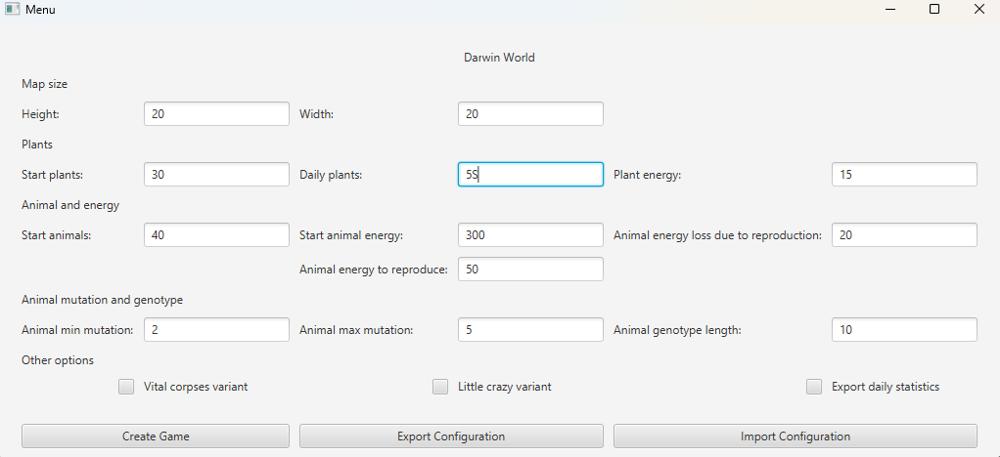
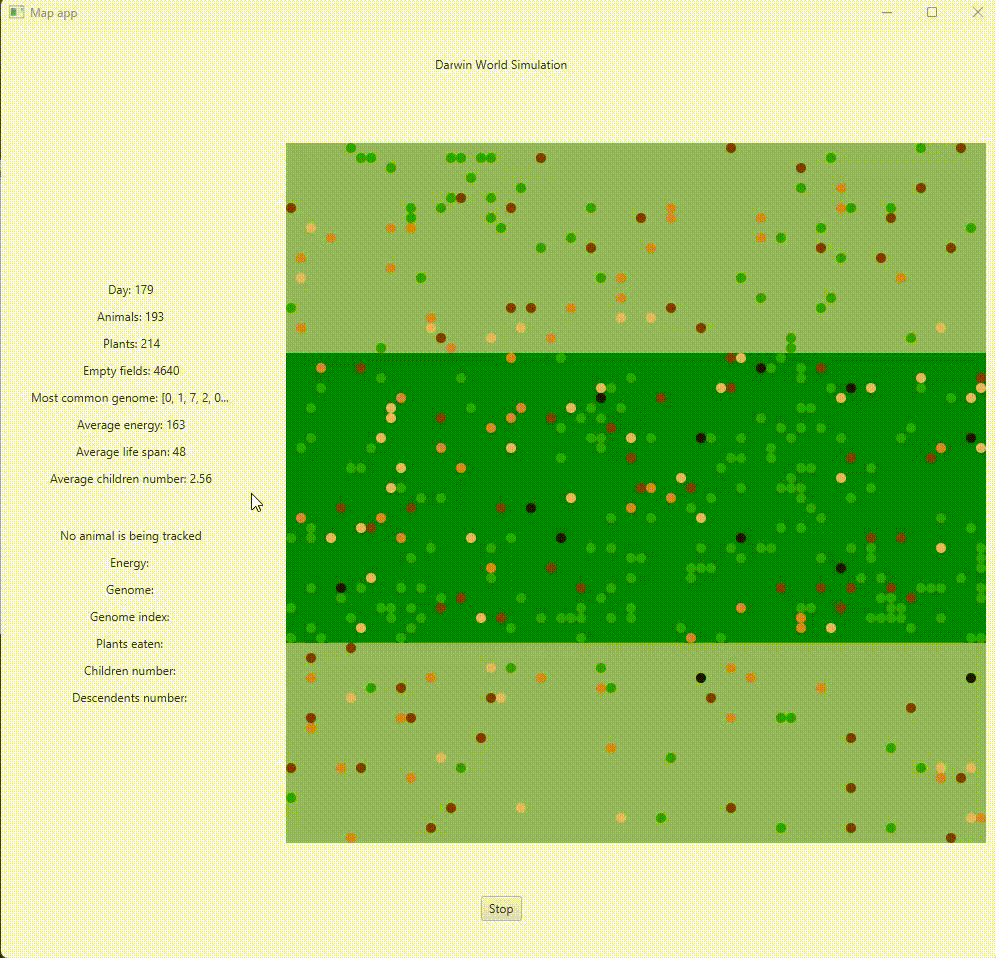
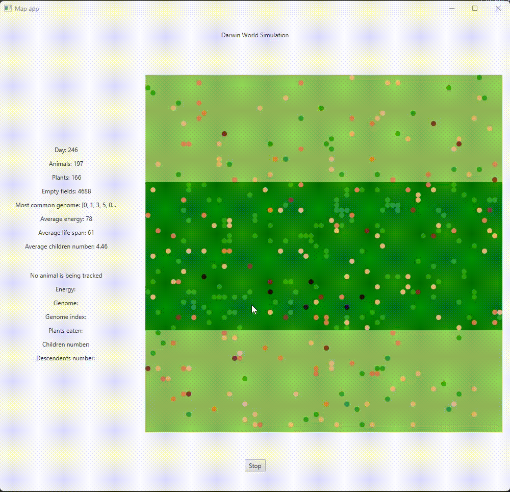

Darwin World Simulation
=============================================== 

<b>Darwin World</b> is a simulation that emulates the evolution of species in a dynamically changing ecosystem. Inspired by the works in "Land of Lisp" by Conrad Barski, an article in "Scientific American", and "Genetic Algorithms in Search, Optimization, and Machine Learning" by David E. Goldberg.

## Features
<ul>
    <li><b>Ecosystem: </b> A grid-based world where animals try to survive, reproduce, and evolve.</li>
    <li><b>Animal Traits: </b>Each animal has specific characteristics, including energy levels crucial for survival and reproduction, as well as a genome type that dictates their movements around the world.</li>
    <li><b>Genetic Algorithm: </b>The animals evolve over time through a genetic algorithm that selects the fittest animals to reproduce and pass on their genes with possible mutations.</li>
    <li><b>Real-time observation of the evolution: </b>The animals evolve over time through a genetic algorithm that selects the fittest animals to reproduce and pass on their genes with possible mutations.</li>
    <li><b>Different variants:</b> Users can enhance unpredictability with two modifications: 
        <ul>
            <li><i>Vital Corpses: </i>Plants tend to grow in places where animals have recently died. </li>
            <li><i>Little Crazy: </i>Animals move in a more chaotic way.</li>
        </ul>   
    </li>
    <li><b>Saving Statistics and Last Configuration:</b>  Users can save their last configuration and import it later, as well as save statistics of the current simulation to a stat.csv file.  </li>
</ul>

## Technologies
<ul>
    <li>Programing language: Java 21</li>
    <li>Frontend library: JavaFx</li>
</ul>

## Authors
<ul>
    <li> <b>Wojciech Pawlina</b> - <a href="https://github.com/Wpawlina" target="_blank">Wpawlina</a></li>
    <li> <b>Szymon Hołysz</b> - <a href="https://github.com/holysz" target="_blank">holysz</a></li>
</ul>
 

